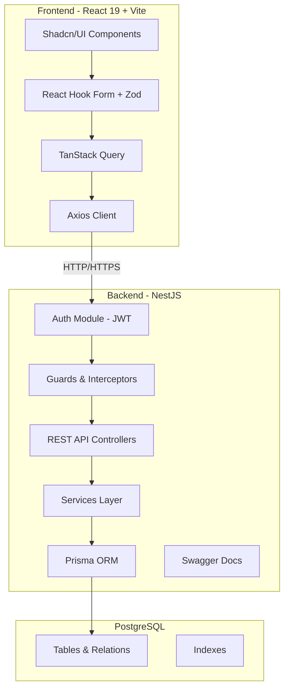
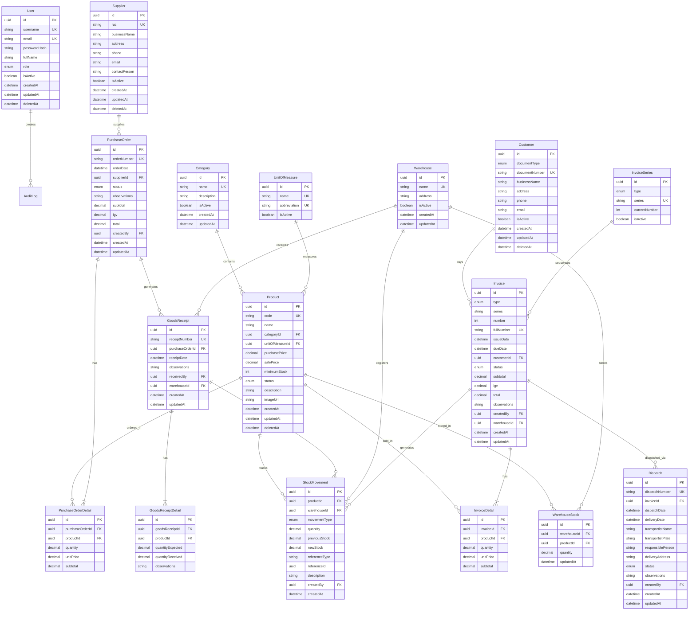
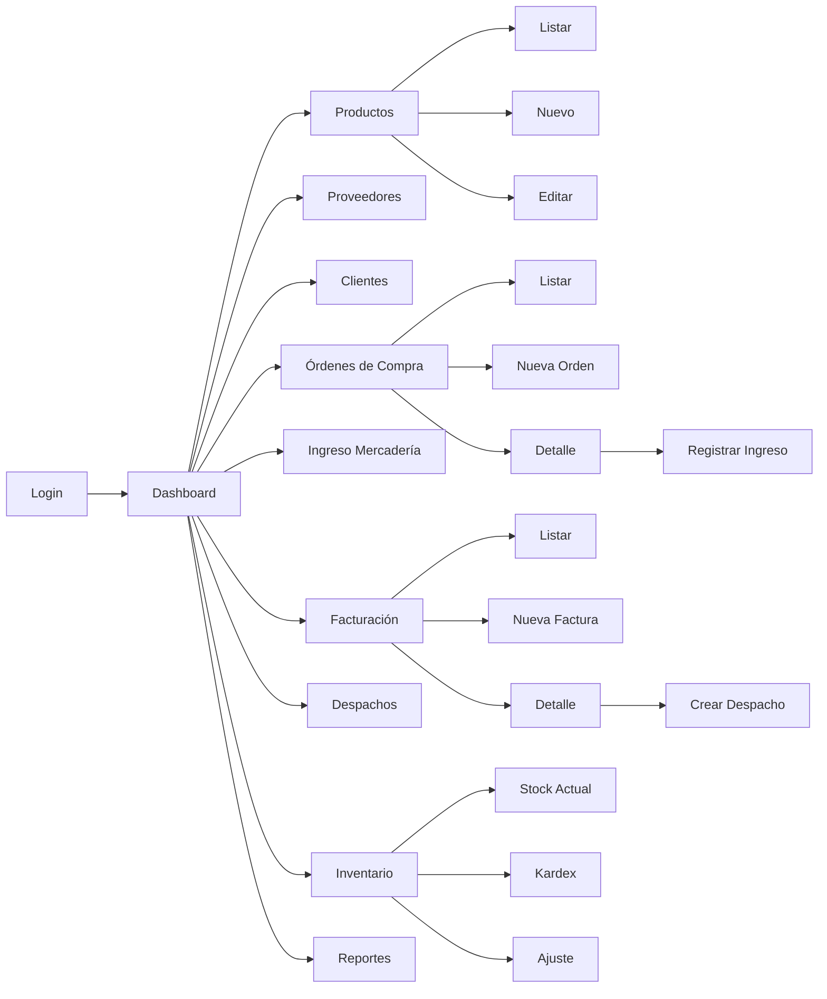
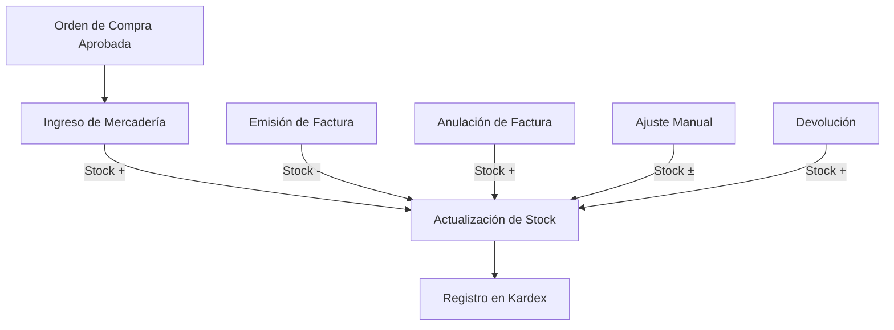

# Sistema de Gestión Comercial e Inventario — Plan de Implementación

## Resumen

Sistema ERP comercial moderno para gestión de compras, inventario, ventas y despachos. Diseñado para una empresa en Lima, Perú, con soporte para normativa tributaria local (IGV 18%, comprobantes electrónicos, series F001/B001).

---

## 1. Arquitectura del Sistema



### Principios de Diseño

| Principio | Implementación |
|-----------|---------------|
| **Separación de responsabilidades** | Controller → Service → Repository (Prisma) |
| **Validación dual** | Zod en frontend + class-validator en backend |
| **Auditoría** | Campos `createdAt`, `updatedAt`, `createdBy`, `updatedBy` en todas las entidades |
| **Soft Delete** | Campo `deletedAt` para eliminación lógica |
| **Multi-almacén** | Tabla `Warehouse` con relación a movimientos de stock |
| **Series de comprobantes** | Tabla `InvoiceSeries` con numeración secuencial |

---

## 2. Diseño de Base de Datos

### 2.1 Diagrama Entidad-Relación



### 2.2 Modelo Prisma

```prisma
// prisma/schema.prisma

generator client {
  provider = "prisma-client-js"
}

datasource db {
  provider = "postgresql"
  url      = env("DATABASE_URL")
}

// ─── ENUMS ──────────────────────────────────────────

enum UserRole {
  ADMIN
  MANAGER
  SALES
  WAREHOUSE
  VIEWER
}

enum ProductStatus {
  ACTIVE
  INACTIVE
  DISCONTINUED
}

enum DocumentType {
  DNI
  RUC
  CE
  PASSPORT
}

enum PurchaseOrderStatus {
  DRAFT
  APPROVED
  RECEIVED
  CANCELLED
}

enum InvoiceType {
  FACTURA
  BOLETA
}

enum InvoiceStatus {
  PENDING
  PAID
  CANCELLED
}

enum DispatchStatus {
  PENDING
  IN_TRANSIT
  DELIVERED
}

enum StockMovementType {
  PURCHASE_ENTRY
  SALE
  ADJUSTMENT
  RETURN
}

// ─── MODELS ─────────────────────────────────────────

model User {
  id           String    @id @default(uuid())
  username     String    @unique
  email        String    @unique
  passwordHash String    @map("password_hash")
  fullName     String    @map("full_name")
  role         UserRole  @default(VIEWER)
  isActive     Boolean   @default(true) @map("is_active")
  createdAt    DateTime  @default(now()) @map("created_at")
  updatedAt    DateTime  @updatedAt @map("updated_at")
  deletedAt    DateTime? @map("deleted_at")

  purchaseOrders PurchaseOrder[]
  goodsReceipts  GoodsReceipt[]
  invoices       Invoice[]
  dispatches     Dispatch[]
  stockMovements StockMovement[]

  @@map("users")
}

model Category {
  id          String   @id @default(uuid())
  name        String   @unique
  description String?
  isActive    Boolean  @default(true) @map("is_active")
  createdAt   DateTime @default(now()) @map("created_at")
  updatedAt   DateTime @updatedAt @map("updated_at")

  products Product[]

  @@map("categories")
}

model UnitOfMeasure {
  id           String  @id @default(uuid())
  name         String  @unique
  abbreviation String  @unique
  isActive     Boolean @default(true) @map("is_active")

  products Product[]

  @@map("units_of_measure")
}

model Product {
  id              String        @id @default(uuid())
  code            String        @unique
  name            String
  categoryId      String        @map("category_id")
  unitOfMeasureId String        @map("unit_of_measure_id")
  purchasePrice   Decimal       @map("purchase_price") @db.Decimal(10, 2)
  salePrice       Decimal       @map("sale_price") @db.Decimal(10, 2)
  minimumStock    Int           @default(0) @map("minimum_stock")
  status          ProductStatus @default(ACTIVE)
  description     String?
  imageUrl        String?       @map("image_url")
  createdAt       DateTime      @default(now()) @map("created_at")
  updatedAt       DateTime      @updatedAt @map("updated_at")
  deletedAt       DateTime?     @map("deleted_at")

  category      Category      @relation(fields: [categoryId], references: [id])
  unitOfMeasure UnitOfMeasure @relation(fields: [unitOfMeasureId], references: [id])

  purchaseOrderDetails PurchaseOrderDetail[]
  invoiceDetails       InvoiceDetail[]
  stockMovements       StockMovement[]
  warehouseStocks      WarehouseStock[]
  goodsReceiptDetails  GoodsReceiptDetail[]

  @@index([categoryId])
  @@index([code])
  @@index([name])
  @@map("products")
}

model Supplier {
  id            String    @id @default(uuid())
  ruc           String    @unique
  businessName  String    @map("business_name")
  address       String?
  phone         String?
  email         String?
  contactPerson String?   @map("contact_person")
  isActive      Boolean   @default(true) @map("is_active")
  createdAt     DateTime  @default(now()) @map("created_at")
  updatedAt     DateTime  @updatedAt @map("updated_at")
  deletedAt     DateTime? @map("deleted_at")

  purchaseOrders PurchaseOrder[]

  @@map("suppliers")
}

model Customer {
  id             String       @id @default(uuid())
  documentType   DocumentType @map("document_type")
  documentNumber String       @unique @map("document_number")
  businessName   String       @map("business_name")
  address        String?
  phone          String?
  email          String?
  isActive       Boolean      @default(true) @map("is_active")
  createdAt      DateTime     @default(now()) @map("created_at")
  updatedAt      DateTime     @updatedAt @map("updated_at")
  deletedAt      DateTime?    @map("deleted_at")

  invoices Invoice[]

  @@map("customers")
}

model Warehouse {
  id        String   @id @default(uuid())
  name      String   @unique
  address   String?
  isActive  Boolean  @default(true) @map("is_active")
  createdAt DateTime @default(now()) @map("created_at")
  updatedAt DateTime @updatedAt @map("updated_at")

  warehouseStocks WarehouseStock[]
  goodsReceipts   GoodsReceipt[]
  stockMovements  StockMovement[]
  invoices        Invoice[]

  @@map("warehouses")
}

model WarehouseStock {
  id          String   @id @default(uuid())
  warehouseId String   @map("warehouse_id")
  productId   String   @map("product_id")
  quantity    Decimal  @default(0) @db.Decimal(10, 2)
  updatedAt   DateTime @updatedAt @map("updated_at")

  warehouse Warehouse @relation(fields: [warehouseId], references: [id])
  product   Product   @relation(fields: [productId], references: [id])

  @@unique([warehouseId, productId])
  @@map("warehouse_stocks")
}

// ─── PURCHASE ORDERS ────────────────────────────────

model PurchaseOrder {
  id           String              @id @default(uuid())
  orderNumber  String              @unique @map("order_number")
  orderDate    DateTime            @map("order_date")
  supplierId   String              @map("supplier_id")
  status       PurchaseOrderStatus @default(DRAFT)
  observations String?
  subtotal     Decimal             @default(0) @db.Decimal(10, 2)
  igv          Decimal             @default(0) @db.Decimal(10, 2)
  total        Decimal             @default(0) @db.Decimal(10, 2)
  createdBy    String              @map("created_by")
  createdAt    DateTime            @default(now()) @map("created_at")
  updatedAt    DateTime            @updatedAt @map("updated_at")

  supplier Supplier @relation(fields: [supplierId], references: [id])
  creator  User     @relation(fields: [createdBy], references: [id])

  details       PurchaseOrderDetail[]
  goodsReceipts GoodsReceipt[]

  @@index([supplierId])
  @@index([orderDate])
  @@index([status])
  @@map("purchase_orders")
}

model PurchaseOrderDetail {
  id              String  @id @default(uuid())
  purchaseOrderId String  @map("purchase_order_id")
  productId       String  @map("product_id")
  quantity        Decimal @db.Decimal(10, 2)
  unitPrice       Decimal @map("unit_price") @db.Decimal(10, 2)
  subtotal        Decimal @db.Decimal(10, 2)

  purchaseOrder PurchaseOrder @relation(fields: [purchaseOrderId], references: [id], onDelete: Cascade)
  product       Product       @relation(fields: [productId], references: [id])

  @@map("purchase_order_details")
}

// ─── GOODS RECEIPT ──────────────────────────────────

model GoodsReceipt {
  id              String   @id @default(uuid())
  receiptNumber   String   @unique @map("receipt_number")
  purchaseOrderId String   @map("purchase_order_id")
  receiptDate     DateTime @map("receipt_date")
  observations    String?
  receivedBy      String   @map("received_by")
  warehouseId     String   @map("warehouse_id")
  createdAt       DateTime @default(now()) @map("created_at")
  updatedAt       DateTime @updatedAt @map("updated_at")

  purchaseOrder PurchaseOrder @relation(fields: [purchaseOrderId], references: [id])
  receiver      User          @relation(fields: [receivedBy], references: [id])
  warehouse     Warehouse     @relation(fields: [warehouseId], references: [id])

  details        GoodsReceiptDetail[]
  stockMovements StockMovement[]

  @@index([purchaseOrderId])
  @@map("goods_receipts")
}

model GoodsReceiptDetail {
  id               String  @id @default(uuid())
  goodsReceiptId   String  @map("goods_receipt_id")
  productId        String  @map("product_id")
  quantityExpected Decimal @map("quantity_expected") @db.Decimal(10, 2)
  quantityReceived Decimal @map("quantity_received") @db.Decimal(10, 2)
  observations     String?

  goodsReceipt GoodsReceipt @relation(fields: [goodsReceiptId], references: [id], onDelete: Cascade)
  product      Product      @relation(fields: [productId], references: [id])

  @@map("goods_receipt_details")
}

// ─── INVOICING ──────────────────────────────────────

model InvoiceSeries {
  id            String      @id @default(uuid())
  type          InvoiceType
  series        String      @unique
  currentNumber Int         @default(0) @map("current_number")
  isActive      Boolean     @default(true) @map("is_active")

  @@map("invoice_series")
}

model Invoice {
  id           String        @id @default(uuid())
  type         InvoiceType
  series       String
  number       Int
  fullNumber   String        @unique @map("full_number")
  issueDate    DateTime      @map("issue_date")
  dueDate      DateTime?     @map("due_date")
  customerId   String        @map("customer_id")
  status       InvoiceStatus @default(PENDING)
  subtotal     Decimal       @db.Decimal(10, 2)
  igv          Decimal       @db.Decimal(10, 2)
  total        Decimal       @db.Decimal(10, 2)
  observations String?
  createdBy    String        @map("created_by")
  warehouseId  String        @map("warehouse_id")
  createdAt    DateTime      @default(now()) @map("created_at")
  updatedAt    DateTime      @updatedAt @map("updated_at")

  customer  Customer  @relation(fields: [customerId], references: [id])
  creator   User      @relation(fields: [createdBy], references: [id])
  warehouse Warehouse @relation(fields: [warehouseId], references: [id])

  details        InvoiceDetail[]
  dispatches     Dispatch[]
  stockMovements StockMovement[]

  @@unique([series, number])
  @@index([customerId])
  @@index([issueDate])
  @@index([status])
  @@map("invoices")
}

model InvoiceDetail {
  id        String  @id @default(uuid())
  invoiceId String  @map("invoice_id")
  productId String  @map("product_id")
  quantity  Decimal @db.Decimal(10, 2)
  unitPrice Decimal @map("unit_price") @db.Decimal(10, 2)
  subtotal  Decimal @db.Decimal(10, 2)

  invoice Invoice @relation(fields: [invoiceId], references: [id], onDelete: Cascade)
  product Product @relation(fields: [productId], references: [id])

  @@map("invoice_details")
}

// ─── DISPATCHES ─────────────────────────────────────

model Dispatch {
  id                String         @id @default(uuid())
  dispatchNumber    String         @unique @map("dispatch_number")
  invoiceId         String         @map("invoice_id")
  dispatchDate      DateTime       @map("dispatch_date")
  deliveryDate      DateTime?      @map("delivery_date")
  transportistName  String?        @map("transportist_name")
  transportistPlate String?        @map("transportist_plate")
  responsiblePerson String?        @map("responsible_person")
  deliveryAddress   String?        @map("delivery_address")
  status            DispatchStatus @default(PENDING)
  observations      String?
  createdBy         String         @map("created_by")
  createdAt         DateTime       @default(now()) @map("created_at")
  updatedAt         DateTime       @updatedAt @map("updated_at")

  invoice Invoice @relation(fields: [invoiceId], references: [id])
  creator User    @relation(fields: [createdBy], references: [id])

  @@index([invoiceId])
  @@index([status])
  @@map("dispatches")
}

// ─── STOCK MOVEMENTS (KARDEX) ───────────────────────

model StockMovement {
  id            String            @id @default(uuid())
  productId     String            @map("product_id")
  warehouseId   String            @map("warehouse_id")
  movementType  StockMovementType @map("movement_type")
  quantity      Decimal           @db.Decimal(10, 2)
  previousStock Decimal           @map("previous_stock") @db.Decimal(10, 2)
  newStock      Decimal           @map("new_stock") @db.Decimal(10, 2)
  referenceType String?           @map("reference_type")
  referenceId   String?           @map("reference_id")
  description   String?
  createdBy     String            @map("created_by")
  createdAt     DateTime          @default(now()) @map("created_at")

  product       Product        @relation(fields: [productId], references: [id])
  warehouse     Warehouse      @relation(fields: [warehouseId], references: [id])
  creator       User           @relation(fields: [createdBy], references: [id])
  goodsReceipt  GoodsReceipt?  @relation(fields: [referenceId], references: [id], map: "fk_stock_movement_goods_receipt")

  @@index([productId, warehouseId])
  @@index([movementType])
  @@index([createdAt])
  @@map("stock_movements")
}
```

---

## 3. Estructura de Carpetas

### 3.1 Backend — `inventario-backend/`

```
inventario-backend/
├── prisma/
│   ├── schema.prisma
│   ├── seed.ts
│   └── migrations/
├── src/
│   ├── main.ts
│   ├── app.module.ts
│   ├── common/
│   │   ├── decorators/
│   │   │   ├── current-user.decorator.ts
│   │   │   └── roles.decorator.ts
│   │   ├── dto/
│   │   │   ├── pagination.dto.ts
│   │   │   └── api-response.dto.ts
│   │   ├── filters/
│   │   │   └── http-exception.filter.ts
│   │   ├── guards/
│   │   │   ├── jwt-auth.guard.ts
│   │   │   └── roles.guard.ts
│   │   ├── interceptors/
│   │   │   ├── transform.interceptor.ts
│   │   │   └── logging.interceptor.ts
│   │   └── utils/
│   │       └── pagination.util.ts
│   ├── config/
│   │   ├── app.config.ts
│   │   ├── jwt.config.ts
│   │   └── database.config.ts
│   ├── prisma/
│   │   ├── prisma.module.ts
│   │   └── prisma.service.ts
│   ├── modules/
│   │   ├── auth/
│   │   │   ├── auth.module.ts
│   │   │   ├── auth.controller.ts
│   │   │   ├── auth.service.ts
│   │   │   ├── strategies/
│   │   │   │   └── jwt.strategy.ts
│   │   │   └── dto/
│   │   │       ├── login.dto.ts
│   │   │       └── auth-response.dto.ts
│   │   ├── users/
│   │   │   ├── users.module.ts
│   │   │   ├── users.controller.ts
│   │   │   ├── users.service.ts
│   │   │   └── dto/
│   │   │       ├── create-user.dto.ts
│   │   │       └── update-user.dto.ts
│   │   ├── categories/
│   │   │   ├── categories.module.ts
│   │   │   ├── categories.controller.ts
│   │   │   ├── categories.service.ts
│   │   │   └── dto/
│   │   ├── products/
│   │   │   ├── products.module.ts
│   │   │   ├── products.controller.ts
│   │   │   ├── products.service.ts
│   │   │   └── dto/
│   │   ├── suppliers/
│   │   │   ├── suppliers.module.ts
│   │   │   ├── suppliers.controller.ts
│   │   │   ├── suppliers.service.ts
│   │   │   └── dto/
│   │   ├── customers/
│   │   │   ├── customers.module.ts
│   │   │   ├── customers.controller.ts
│   │   │   ├── customers.service.ts
│   │   │   └── dto/
│   │   ├── warehouses/
│   │   │   ├── warehouses.module.ts
│   │   │   ├── warehouses.controller.ts
│   │   │   ├── warehouses.service.ts
│   │   │   └── dto/
│   │   ├── purchase-orders/
│   │   │   ├── purchase-orders.module.ts
│   │   │   ├── purchase-orders.controller.ts
│   │   │   ├── purchase-orders.service.ts
│   │   │   └── dto/
│   │   ├── goods-receipts/
│   │   │   ├── goods-receipts.module.ts
│   │   │   ├── goods-receipts.controller.ts
│   │   │   ├── goods-receipts.service.ts
│   │   │   └── dto/
│   │   ├── invoices/
│   │   │   ├── invoices.module.ts
│   │   │   ├── invoices.controller.ts
│   │   │   ├── invoices.service.ts
│   │   │   └── dto/
│   │   ├── dispatches/
│   │   │   ├── dispatches.module.ts
│   │   │   ├── dispatches.controller.ts
│   │   │   ├── dispatches.service.ts
│   │   │   └── dto/
│   │   ├── inventory/
│   │   │   ├── inventory.module.ts
│   │   │   ├── inventory.controller.ts
│   │   │   ├── inventory.service.ts
│   │   │   └── dto/
│   │   ├── reports/
│   │   │   ├── reports.module.ts
│   │   │   ├── reports.controller.ts
│   │   │   └── reports.service.ts
│   │   └── dashboard/
│   │       ├── dashboard.module.ts
│   │       ├── dashboard.controller.ts
│   │       └── dashboard.service.ts
├── test/
├── .env
├── .env.example
├── nest-cli.json
├── tsconfig.json
├── tsconfig.build.json
└── package.json
```

### 3.2 Frontend — `inventario-frontend/`

```
inventario-frontend/
├── public/
│   └── favicon.svg
├── src/
│   ├── main.tsx
│   ├── App.tsx
│   ├── vite-env.d.ts
│   ├── api/
│   │   ├── axios.ts
│   │   ├── auth.api.ts
│   │   ├── products.api.ts
│   │   ├── suppliers.api.ts
│   │   ├── customers.api.ts
│   │   ├── purchase-orders.api.ts
│   │   ├── goods-receipts.api.ts
│   │   ├── invoices.api.ts
│   │   ├── dispatches.api.ts
│   │   ├── inventory.api.ts
│   │   ├── reports.api.ts
│   │   └── dashboard.api.ts
│   ├── components/
│   │   ├── ui/                    ← Shadcn/UI components
│   │   ├── layout/
│   │   │   ├── AppLayout.tsx
│   │   │   ├── Sidebar.tsx
│   │   │   ├── Header.tsx
│   │   │   └── Breadcrumb.tsx
│   │   ├── shared/
│   │   │   ├── DataTable.tsx
│   │   │   ├── StatusBadge.tsx
│   │   │   ├── ConfirmDialog.tsx
│   │   │   ├── SearchInput.tsx
│   │   │   ├── LoadingSpinner.tsx
│   │   │   └── EmptyState.tsx
│   │   └── forms/
│   │       ├── ProductForm.tsx
│   │       ├── SupplierForm.tsx
│   │       ├── CustomerForm.tsx
│   │       └── ...
│   ├── hooks/
│   │   ├── useAuth.ts
│   │   ├── useProducts.ts
│   │   ├── useSuppliers.ts
│   │   ├── useCustomers.ts
│   │   ├── usePurchaseOrders.ts
│   │   ├── useInvoices.ts
│   │   └── ...
│   ├── lib/
│   │   ├── utils.ts
│   │   └── constants.ts
│   ├── pages/
│   │   ├── auth/
│   │   │   └── LoginPage.tsx
│   │   ├── dashboard/
│   │   │   └── DashboardPage.tsx
│   │   ├── products/
│   │   │   ├── ProductsListPage.tsx
│   │   │   └── ProductFormPage.tsx
│   │   ├── suppliers/
│   │   │   ├── SuppliersListPage.tsx
│   │   │   └── SupplierFormPage.tsx
│   │   ├── customers/
│   │   │   ├── CustomersListPage.tsx
│   │   │   └── CustomerFormPage.tsx
│   │   ├── purchase-orders/
│   │   │   ├── PurchaseOrdersListPage.tsx
│   │   │   ├── PurchaseOrderFormPage.tsx
│   │   │   └── PurchaseOrderDetailPage.tsx
│   │   ├── goods-receipts/
│   │   │   ├── GoodsReceiptsListPage.tsx
│   │   │   └── GoodsReceiptFormPage.tsx
│   │   ├── invoices/
│   │   │   ├── InvoicesListPage.tsx
│   │   │   ├── InvoiceFormPage.tsx
│   │   │   └── InvoiceDetailPage.tsx
│   │   ├── dispatches/
│   │   │   ├── DispatchesListPage.tsx
│   │   │   └── DispatchFormPage.tsx
│   │   ├── inventory/
│   │   │   ├── InventoryPage.tsx
│   │   │   └── KardexPage.tsx
│   │   └── reports/
│   │       └── ReportsPage.tsx
│   ├── router/
│   │   ├── index.tsx
│   │   ├── ProtectedRoute.tsx
│   │   └── routes.ts
│   ├── store/
│   │   └── auth.store.ts
│   ├── types/
│   │   ├── auth.types.ts
│   │   ├── product.types.ts
│   │   ├── supplier.types.ts
│   │   ├── customer.types.ts
│   │   ├── purchase-order.types.ts
│   │   ├── invoice.types.ts
│   │   ├── dispatch.types.ts
│   │   ├── inventory.types.ts
│   │   └── common.types.ts
│   └── validations/
│       ├── product.schema.ts
│       ├── supplier.schema.ts
│       ├── customer.schema.ts
│       ├── purchase-order.schema.ts
│       ├── invoice.schema.ts
│       └── dispatch.schema.ts
├── components.json              ← Shadcn/UI config
├── tailwind.config.ts
├── postcss.config.js
├── tsconfig.json
├── tsconfig.app.json
├── vite.config.ts
├── index.html
├── .env
├── .env.example
└── package.json
```

---

## 4. APIs REST

### 4.1 Autenticación

| Método | Endpoint | Descripción |
|--------|----------|-------------|
| POST | `/api/auth/login` | Iniciar sesión |
| POST | `/api/auth/logout` | Cerrar sesión |
| GET | `/api/auth/profile` | Obtener perfil del usuario autenticado |
| POST | `/api/auth/refresh` | Refrescar token JWT |

### 4.2 Dashboard

| Método | Endpoint | Descripción |
|--------|----------|-------------|
| GET | `/api/dashboard/summary` | Totales generales (productos, stock, compras, ventas) |
| GET | `/api/dashboard/monthly-sales` | Ventas mensuales para gráfico |
| GET | `/api/dashboard/top-products` | Productos más vendidos |

### 4.3 Productos

| Método | Endpoint | Descripción |
|--------|----------|-------------|
| GET | `/api/products` | Listar productos (paginado, filtros) |
| GET | `/api/products/:id` | Obtener producto por ID |
| POST | `/api/products` | Crear producto |
| PATCH | `/api/products/:id` | Actualizar producto |
| DELETE | `/api/products/:id` | Eliminar producto (soft delete) |
| GET | `/api/products/search?q=term` | Buscar productos |

### 4.4 Categorías

| Método | Endpoint | Descripción |
|--------|----------|-------------|
| GET | `/api/categories` | Listar categorías |
| POST | `/api/categories` | Crear categoría |
| PATCH | `/api/categories/:id` | Actualizar categoría |
| DELETE | `/api/categories/:id` | Eliminar categoría |

### 4.5 Unidades de Medida

| Método | Endpoint | Descripción |
|--------|----------|-------------|
| GET | `/api/units-of-measure` | Listar unidades |
| POST | `/api/units-of-measure` | Crear unidad |

### 4.6 Proveedores

| Método | Endpoint | Descripción |
|--------|----------|-------------|
| GET | `/api/suppliers` | Listar proveedores |
| GET | `/api/suppliers/:id` | Obtener proveedor |
| POST | `/api/suppliers` | Crear proveedor |
| PATCH | `/api/suppliers/:id` | Actualizar proveedor |
| DELETE | `/api/suppliers/:id` | Eliminar proveedor (soft delete) |

### 4.7 Clientes

| Método | Endpoint | Descripción |
|--------|----------|-------------|
| GET | `/api/customers` | Listar clientes |
| GET | `/api/customers/:id` | Obtener cliente |
| POST | `/api/customers` | Crear cliente |
| PATCH | `/api/customers/:id` | Actualizar cliente |
| DELETE | `/api/customers/:id` | Eliminar cliente (soft delete) |

### 4.8 Almacenes

| Método | Endpoint | Descripción |
|--------|----------|-------------|
| GET | `/api/warehouses` | Listar almacenes |
| POST | `/api/warehouses` | Crear almacén |
| PATCH | `/api/warehouses/:id` | Actualizar almacén |
| GET | `/api/warehouses/:id/stock` | Stock del almacén |

### 4.9 Órdenes de Compra

| Método | Endpoint | Descripción |
|--------|----------|-------------|
| GET | `/api/purchase-orders` | Listar órdenes |
| GET | `/api/purchase-orders/:id` | Obtener orden con detalles |
| POST | `/api/purchase-orders` | Crear orden |
| PATCH | `/api/purchase-orders/:id` | Actualizar orden |
| PATCH | `/api/purchase-orders/:id/approve` | Aprobar orden |
| PATCH | `/api/purchase-orders/:id/cancel` | Anular orden |

### 4.10 Ingreso de Mercadería

| Método | Endpoint | Descripción |
|--------|----------|-------------|
| GET | `/api/goods-receipts` | Listar ingresos |
| GET | `/api/goods-receipts/:id` | Obtener ingreso con detalles |
| POST | `/api/goods-receipts` | Registrar ingreso (actualiza stock) |

### 4.11 Facturación

| Método | Endpoint | Descripción |
|--------|----------|-------------|
| GET | `/api/invoices` | Listar facturas/boletas |
| GET | `/api/invoices/:id` | Obtener factura con detalles |
| POST | `/api/invoices` | Emitir factura (descuenta stock) |
| PATCH | `/api/invoices/:id/pay` | Marcar como pagada |
| PATCH | `/api/invoices/:id/cancel` | Anular factura (devuelve stock) |
| GET | `/api/invoice-series` | Listar series |

### 4.12 Despachos

| Método | Endpoint | Descripción |
|--------|----------|-------------|
| GET | `/api/dispatches` | Listar despachos |
| GET | `/api/dispatches/:id` | Obtener despacho |
| POST | `/api/dispatches` | Crear despacho |
| PATCH | `/api/dispatches/:id/in-transit` | Marcar en ruta |
| PATCH | `/api/dispatches/:id/delivered` | Marcar entregado |

### 4.13 Inventario / Kardex

| Método | Endpoint | Descripción |
|--------|----------|-------------|
| GET | `/api/inventory/stock` | Stock actual por almacén |
| GET | `/api/inventory/kardex` | Kardex de un producto |
| POST | `/api/inventory/adjustment` | Ajuste manual de stock |
| GET | `/api/inventory/low-stock` | Productos bajo stock mínimo |

### 4.14 Reportes

| Método | Endpoint | Descripción |
|--------|----------|-------------|
| GET | `/api/reports/sales` | Ventas por período |
| GET | `/api/reports/purchases` | Compras por período |
| GET | `/api/reports/stock` | Stock actual |
| GET | `/api/reports/top-products` | Productos más vendidos |
| GET | `/api/reports/kardex` | Kardex completo |

---

## 5. Flujo de Navegación



### Rutas del Frontend

| Ruta | Página | Descripción |
|------|--------|-------------|
| `/login` | LoginPage | Inicio de sesión |
| `/` | DashboardPage | Dashboard principal |
| `/products` | ProductsListPage | Lista de productos |
| `/products/new` | ProductFormPage | Nuevo producto |
| `/products/:id/edit` | ProductFormPage | Editar producto |
| `/suppliers` | SuppliersListPage | Lista de proveedores |
| `/suppliers/new` | SupplierFormPage | Nuevo proveedor |
| `/suppliers/:id/edit` | SupplierFormPage | Editar proveedor |
| `/customers` | CustomersListPage | Lista de clientes |
| `/customers/new` | CustomerFormPage | Nuevo cliente |
| `/customers/:id/edit` | CustomerFormPage | Editar cliente |
| `/purchase-orders` | PurchaseOrdersListPage | Lista de órdenes de compra |
| `/purchase-orders/new` | PurchaseOrderFormPage | Nueva orden |
| `/purchase-orders/:id` | PurchaseOrderDetailPage | Detalle de orden |
| `/goods-receipts` | GoodsReceiptsListPage | Lista de ingresos |
| `/goods-receipts/new/:poId` | GoodsReceiptFormPage | Registrar ingreso |
| `/invoices` | InvoicesListPage | Lista de facturas |
| `/invoices/new` | InvoiceFormPage | Nueva factura |
| `/invoices/:id` | InvoiceDetailPage | Detalle de factura |
| `/dispatches` | DispatchesListPage | Lista de despachos |
| `/dispatches/new/:invoiceId` | DispatchFormPage | Nuevo despacho |
| `/inventory` | InventoryPage | Stock actual |
| `/inventory/kardex` | KardexPage | Kardex |
| `/reports` | ReportsPage | Reportes |

---

## 6. Reglas de Negocio Clave

### 6.1 IGV (Impuesto General a las Ventas)

```
Subtotal = Σ(cantidad × precio_unitario)
IGV = Subtotal × 0.18
Total = Subtotal + IGV
```

### 6.2 Numeración de Comprobantes

- **Facturas**: Serie `F001`, correlativo auto-incremental → `F001-00000001`
- **Boletas**: Serie `B001`, correlativo auto-incremental → `B001-00000001`
- La numeración es atómica (transacción) para evitar duplicados

### 6.3 Flujo de Stock



### 6.4 Validaciones Importantes

- No se puede facturar si no hay stock suficiente
- No se puede despachar una factura anulada
- No se puede recibir mercadería de una OC no aprobada
- El RUC debe tener 11 dígitos (proveedores)
- El DNI debe tener 8 dígitos (clientes)
- Las facturas requieren cliente con RUC
- Las boletas permiten DNI o sin documento (hasta S/700)

---

## 7. Roadmap de Desarrollo

### Fase 1 — Fundación (Semana 1-2)

| Tarea | Prioridad |
|-------|-----------|
| Configurar repositorios Frontend y Backend | 🔴 Alta |
| Configurar Prisma + PostgreSQL + migraciones | 🔴 Alta |
| Implementar módulo de Autenticación (JWT) | 🔴 Alta |
| Crear layout principal del Frontend (Sidebar, Header) | 🔴 Alta |
| Configurar Axios + interceptors + TanStack Query | 🔴 Alta |
| Configurar Swagger en Backend | 🟡 Media |
| Seed de datos iniciales (categorías, unidades, admin) | 🟡 Media |

### Fase 2 — Maestros (Semana 3-4)

| Tarea | Prioridad |
|-------|-----------|
| CRUD Categorías | 🔴 Alta |
| CRUD Unidades de Medida | 🔴 Alta |
| CRUD Productos | 🔴 Alta |
| CRUD Proveedores | 🔴 Alta |
| CRUD Clientes | 🔴 Alta |
| CRUD Almacenes | 🟡 Media |
| Componente DataTable reutilizable | 🔴 Alta |

### Fase 3 — Compras (Semana 5-6)

| Tarea | Prioridad |
|-------|-----------|
| Gestión de Órdenes de Compra (cabecera + detalle) | 🔴 Alta |
| Flujo de estados de OC (Borrador → Aprobada → Recibida) | 🔴 Alta |
| Ingreso de Mercadería vinculado a OC | 🔴 Alta |
| Actualización automática de stock al ingresar mercadería | 🔴 Alta |
| Comparación solicitado vs. recibido | 🟡 Media |

### Fase 4 — Ventas y Facturación (Semana 7-8)

| Tarea | Prioridad |
|-------|-----------|
| Series de comprobantes (F001, B001) | 🔴 Alta |
| Emisión de Facturas/Boletas con cálculo de IGV | 🔴 Alta |
| Descuento automático de stock | 🔴 Alta |
| Flujo de estados (Pendiente → Pagada / Anulada) | 🔴 Alta |
| Validaciones de stock y tipo de documento | 🔴 Alta |

### Fase 5 — Despachos e Inventario (Semana 9-10)

| Tarea | Prioridad |
|-------|-----------|
| Gestión de Despachos | 🔴 Alta |
| Flujo de estados de despacho | 🔴 Alta |
| Kardex completo | 🔴 Alta |
| Ajustes manuales de stock | 🟡 Media |
| Vista de inventario por almacén | 🟡 Media |

### Fase 6 — Dashboard y Reportes (Semana 11-12)

| Tarea | Prioridad |
|-------|-----------|
| Dashboard con KPIs | 🔴 Alta |
| Gráficos de ventas mensuales | 🟡 Media |
| Gráficos de productos más vendidos | 🟡 Media |
| Reporte de ventas por período | 🔴 Alta |
| Reporte de compras por período | 🔴 Alta |
| Reporte de stock actual | 🔴 Alta |
| Reporte de Kardex | 🟡 Media |

### Fase 7 — Pulido y Extras (Semana 13+)

| Tarea | Prioridad |
|-------|-----------|
| Exportación a Excel/PDF | 🟡 Media |
| Gestión de usuarios y roles | 🟡 Media |
| Auditoría de acciones | 🟢 Baja |
| Optimización de rendimiento | 🟡 Media |
| Testing E2E | 🟡 Media |

---

## 8. Plan de Implementación — Primera Iteración

> [!IMPORTANT]
> **Comenzaremos con la Fase 1 (Fundación)** después de la aprobación de este plan. Esto incluye la inicialización de ambos repositorios, configuración de la base de datos, y el sistema de autenticación completo.

### Paso 1: Backend — Scaffolding

1. Crear proyecto NestJS en `inventario-backend/`
2. Instalar dependencias: Prisma, Passport, JWT, bcrypt, class-validator, Swagger
3. Configurar Prisma con el schema completo
4. Ejecutar migraciones
5. Crear seed con datos iniciales

### Paso 2: Backend — Auth Module

1. Implementar `AuthService` (login, validate, token generation)
2. Implementar `JwtStrategy`
3. Crear guards: `JwtAuthGuard`, `RolesGuard`
4. Decoradores: `@CurrentUser()`, `@Roles()`
5. Endpoints: login, profile, refresh

### Paso 3: Frontend — Scaffolding

1. Crear proyecto Vite + React 19 + TypeScript en `inventario-frontend/`
2. Instalar y configurar TailwindCSS
3. Instalar y configurar Shadcn/UI
4. Configurar React Router
5. Configurar Axios con interceptors JWT
6. Configurar TanStack Query

### Paso 4: Frontend — Layout + Auth

1. Crear `AppLayout` con Sidebar colapsable y Header
2. Implementar `LoginPage`
3. Implementar `ProtectedRoute`
4. Crear store de autenticación
5. Implementar `DashboardPage` (placeholder inicial)

---

## User Review Required

> [!IMPORTANT]
> **Decisiones que requieren tu confirmación:**
>
> 1. **Ambos repositorios en la misma carpeta `inventario/`?** — Propongo crear `inventario-backend/` e `inventario-frontend/` como subdirectorios de `c:\Users\theda\Documents\inventario\`.
>
> 2. **¿Tienes PostgreSQL instalado localmente?** — Necesitamos definir la conexión a la base de datos. Si no, puedo configurar Docker Compose.
>
> 3. **¿Empezamos con la Fase 1 (Backend + Frontend scaffolding + Auth)?** — O prefieres que modifique el plan primero.

## Open Questions

> [!NOTE]
> **Preguntas de diseño:**
>
> 1. **¿Necesitas multi-empresa (tenancy)?** — El diseño actual es para una sola empresa. Multi-empresa cambiaría significativamente el schema.
>
> 2. **¿Versión de TailwindCSS?** — Recomiendo TailwindCSS v4 (última estable). ¿Confirmas?
>
> 3. **¿Idioma del código?** — Los nombres de variables, funciones y endpoints estarán en inglés (best practice), pero la UI estará en español. ¿De acuerdo?
>
> 4. **¿React Router o TanStack Router?** — Propongo React Router v7 (más maduro), pero TanStack Router es una alternativa moderna.
